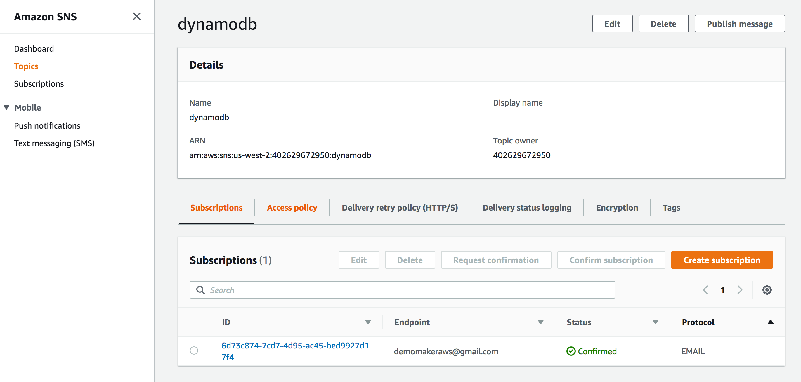
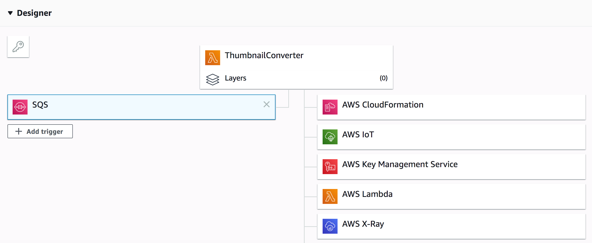
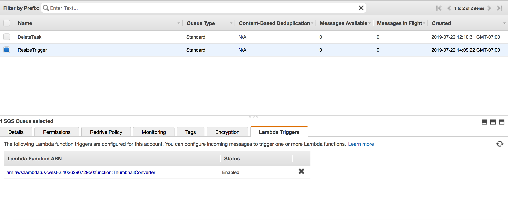
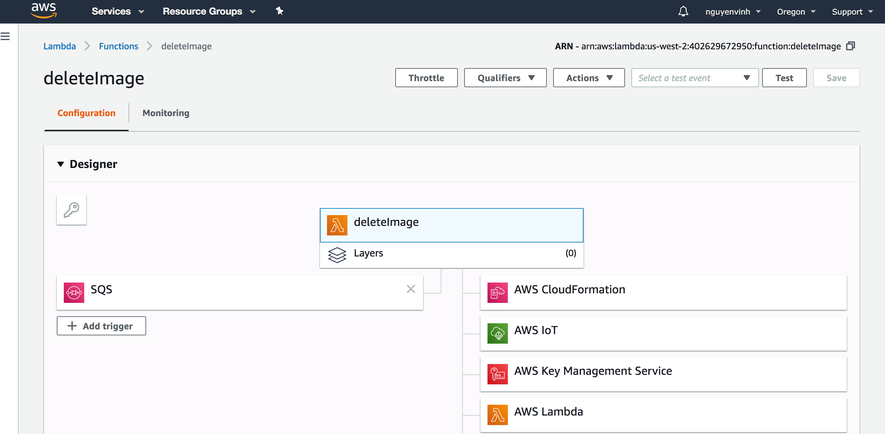

# Taskmaster

Backend:
http://taskmaster-dev.us-west-2.elasticbeanstalk.com/tasks/

Frontend:
http://taskmaster-interface.s3-website-us-west-2.amazonaws.com/

## Intro

This is a API using AWS DynamoDb

This application allows users to retrieve all tasks from the database as well
as create edit, and delete each task.

Users can also upload image to S3 buckets.

## API

        GET /tasks - retrieves all tasks from the database and returns in a JSON format
        GET /tasks?status={available, assigned, accepted, finished} - filters the list
            of task based on the status options provided. More than one option can inserted,
            separated by comma.
        
        GET /users/{name}/tasks - retrieves list of task based on assignee provided
        GET /users/{name}/tasks?status={available, assigned, accepted, finished} -
            filters list of task assigned to user based on status provided
      
        POST /tasks - creates a task with the following two parameters passed in:
            title = {value}
            description = {value}
            assignee = {value}
        
        POST /tasks/{id}/images - takes in a file and uploads it to S3 buckets.
            
        PUT /tasks/{id}/state - changes the state of the task in the following order:
            AVAILABLE -> ASSIGNED -> ACCEPTED -> FINISHED
            Once the task status reaches finished, it can no longer be modified.
            Once task is completed, sends email to administrator: demomakeraws@gmail.com
            
        PUT /tasks/{id}/assign/{assignee}/{phone} - assigns selected task to assignee provided
        also takes in phone number to send SMS to user assigned.
        Phone number must be an 11-digit number (E.G. 15558675309)
        
        DELETE /tasks - deletes all tasks
        DELETE /tasks/{id} - deletes selected task
            
## Notes

Used AmazonDynamoDBClientBuilder as AmazonDynamoDBClient is deprecated

No Views, API interaction can be done via postman or any other GET/POST/PUT
programs.

Set server to 5000.

This is split up in different AWS accounts due to Amazon Security restrictions.

SNS will take in user's phone number to send a text message

## SNS Set up

## Lambda Triggers

